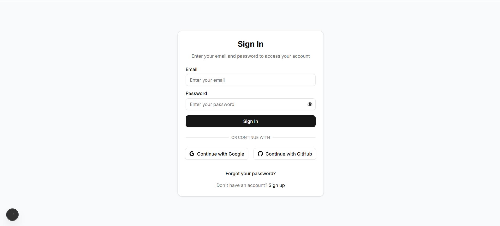
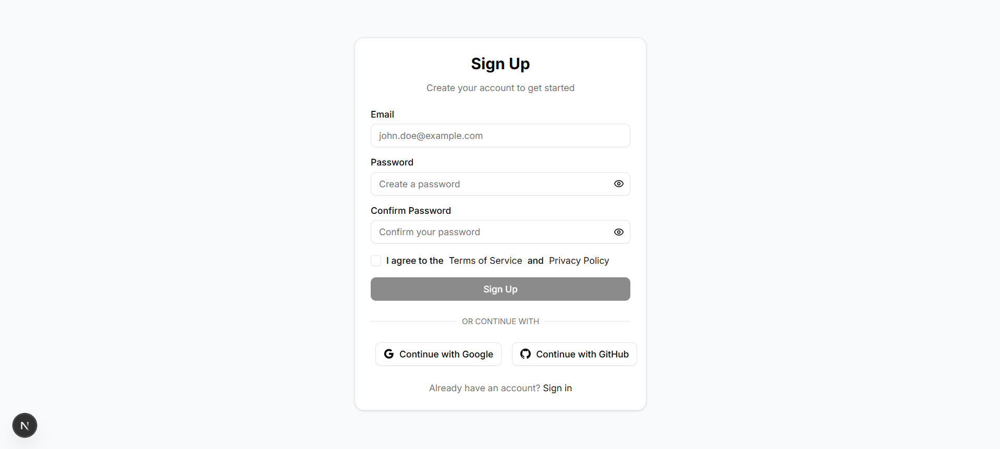
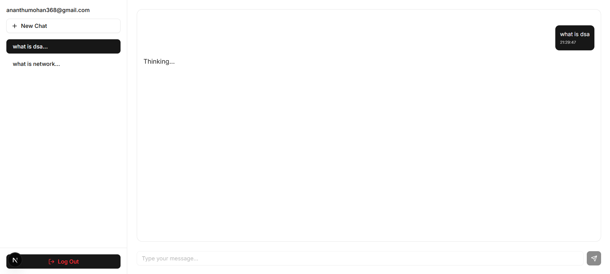

# AI Chat Tool

A modern chat application built with **Next.js**, **Supabase**, and **OpenAI**. Users can **sign up, sign in, create chats, and interact with an AI assistant**, while maintaining a **chat history**. The first message in each chat is automatically used as the chat title.


### Screenshots

#### Sign In


#### Sign Up


#### Chat Window



## Features
- User authentication (Sign Up / Sign In / Logout)
- AI-powered chat using OpenAI API
- Persistent chat history stored in Supabase
- Each chat’s first message is used as its title
- Create new chats dynamically
- Responsive UI using TailwindCSS and shadcn/ui
- Optimistic UI updates for a smooth chat experience


## Tech Stack
- **Frontend:** Next.js 13 (App Router), React, TypeScript
- **Backend:** Supabase (Auth + Postgres DB)
- **AI:** OpenAI API (GPT-3.5 / GPT-4)
- **UI:** TailwindCSS, shadcn/ui, lucide-react icons
- **Version Control:** Git + GitHub

## Project Structure
```

ai-chat-dashboard/
├─ app/
│  ├─ dashboard/
│  │  └─ page.tsx      # Main chat dashboard
│  ├─ signin/
│  │  └─ page.tsx      # Sign In page
│  ├─ signup/
│  │  └─ page.tsx      # Sign Up page
├─ lib/
│  └─ supabase/
│     └─ supabaseClient.ts  # Supabase client setup
├─ components/
│  ├─ ui/
│  │  ├─ button.tsx
│  │  ├─ input.tsx
│  │  └─ card.tsx
├─ public/screenshots/       # Screenshots for README
├─ pages/api/
│  └─ ai.ts                  # OpenAI API handler
├─ package.json
├─ tailwind.config.js
├─ next.config.js
└─ README.md

````

## Setup Instructions

1. Clone the repository:
```bash
git clone <repo-url>
cd ai-chat-dashboard
````

2. Install dependencies:

```bash
npm install
```

3. Create a `.env` file at the root and add your Supabase and OpenAI keys:

```
NEXT_PUBLIC_SUPABASE_URL=your_supabase_url
NEXT_PUBLIC_SUPABASE_ANON_KEY=your_supabase_anon_key
OPENAI_API_KEY=your_openai_key
```

4. Run the development server:

```bash
npm run dev
```

5. Open [http://localhost:3000](http://localhost:3000) in your browser.

## Usage

1. Sign up with an email and password.
2. Sign in to access your dashboard.
3. Create a new chat using the "New Chat" button.
4. Send messages to the AI assistant.
5. Chat history is saved and displayed in the sidebar.
6. Click "Log Out" to end your session.
